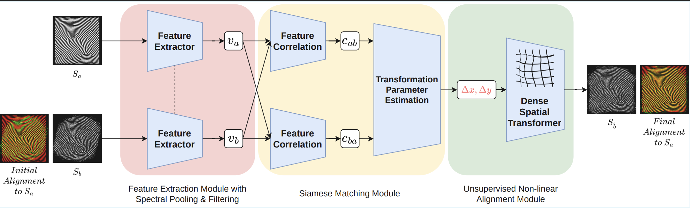
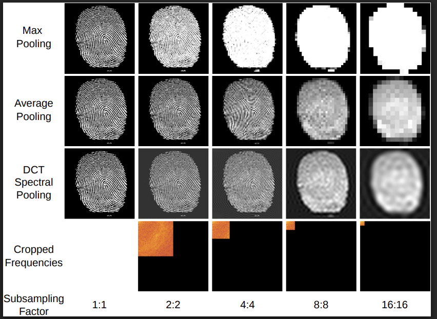

# 2D Gum-Net

### Unsupervised Dense Deformation Grid Prediction for Elastic Fingerprint Alignment


<br>

**TL;DR:** We introduce an unsupervised deep learning framework that predicts dense deformation fields for elastic fingerprint alignment—eliminating the need for ground-truth labels while significantly reducing False Rejection Rates.

<br>


<sub><b>Figure 1.</b> The 2D Gum-Net pipeline: Given a template S<sub>a</sub> and distorted impression S<sub>b</sub>, our framework extracts features via DCT spectral pooling, computes bidirectional correlation maps, and predicts a dense deformation field for pixel-wise alignment—all without supervision.</sub>

</div>

<br>

---

## Overview

> *\"The fundamental challenge in fingerprint recognition isn't matching—it's alignment.\"*

Elastic skin deformation during capture introduces **non-linear distortions** that cause genuine fingerprint pairs to appear different. Traditional approaches either:
- Require expensive ground-truth deformation labels (impractical to obtain)
- Rely on minutiae extraction (fails under severe distortion)
- Use rigid transformations (insufficient for elastic deformation)

**2D Gum-Net** solves this by learning to predict dense deformation fields in a completely **unsupervised** manner, adapting techniques from structural biology (cryo-electron tomography) to the biometrics domain.

<br>

## Key Contributions

<table>
<tr>
<td width=\"50%\" valign=\"top\">

### 1️⃣ Cross-Domain Adaptation
First successful adaptation of 3D subtomogram alignment networks to 2D fingerprint biometrics, demonstrating that unsupervised structural alignment principles generalize across vastly different domains.

### 2️⃣ Unsupervised DDF Prediction
Novel Dense Spatial Transformer (DST) module enables end-to-end learning of pixel-wise deformation fields without any ground-truth supervision—solving the label acquisition bottleneck.

</td>
<td width=\"50%\" valign=\"top\">

### 3️⃣ DCT Spectral Pooling
Frequency-domain pooling layers that preserve ridge and valley microstructure significantly better than conventional spatial pooling, critical for maintaining discriminative fingerprint features.

### 4️⃣ Robust Pre-Match Rectification  
Effective mitigation of elastic torque and non-linear stretching, enabling substantial reduction in False Rejection Rate (FRR) even under severe distortion conditions.

</td>
</tr>
</table>

<br>

---

## Architecture


### Module Details

| Module | Components | Output |
|:-------|:-----------|:-------|
| **Feature Extraction** | CNN backbone + DCT spectral pooling layers | Feature maps $v_a$, $v_b$ |
| **Siamese Matching** | Symmetric 2D correlation layer | Bidirectional correlation maps $C_{ab}, C_{ba}$ |
| **Non-linear Alignment** | Control point regression + Bicubic interpolation | Dense deformation field $\mathbb{\Phi}$ |
| **Spatial Transformer** | Differentiable grid sampling | Aligned impression $S_{\hat{b}}$ |

<br>

### DCT Spectral Pooling: Why It Matters

<div align=\"center\">

<sub><b><br>Figure 2.</b> Comparison of pooling methods across subsampling factors (1:1 → 16:16). DCT spectral pooling preserves ridge structure and fine details significantly better than max or average pooling at aggressive downsampling rates—critical for maintaining discriminative fingerprint features.</sub>
</div>

<br>

**The Problem:** Standard pooling operations (max, average) destroy high-frequency information essential for fingerprint matching.

**Our Solution:** DCT spectral pooling operates in the frequency domain, selectively retaining the most informative coefficients:

```python
from spectral import DCTSpectralPooling

# Create module: downsample 128x128 -> 32x32, keep low-frequency 32x32
pool = DCTSpectralPooling(in_height=128, in_width=128,
                          freq_h=32, freq_w=32,
                          out_height=32, out_width=32)

# Input tensor: (batch, channels, height, width)
x = torch.randn(4, 3, 128, 128)
y = pool(x)
print(x.shape, "->", y.shape)  # expected: (4, 3, 128, 128) -> (4, 3, 32, 32)

# Move to GPU (if available)
device = torch.device('cuda' if torch.cuda.is_available() else 'cpu')
pool = pool.to(device)
x = x.to(device)
y = pool(x)
print("On device:", device, "output shape:", y.shape)
```

<br>

### Training Objective

The network optimizes an unsupervised objective combining structural alignment and spatial smoothness:

$$\mathcal{L}_{\text{total}} = \mathcal{L}_{\text{dice}} + \lambda \cdot \mathcal{L}_{\text{smooth}}$$

| Loss Component | Description | Purpose |
|:---------------|:------------|:--------|
| $\mathcal{L}_{\text{dice}}$ | Soft Dice coefficient between aligned $S_{\hat{b}}$ and template $S_a$ | Maximize structural overlap |
| $\mathcal{L}_{\text{smooth}}$ | Spatial gradient penalty on deformation field $\mathbb{\Phi}$ | Enforce physically plausible deformations |

#### Training quickstart

```python
# from repo root
conda create -n gumnet python=3.10 -y
conda activate gumnet
pip install -r requirements.txt  # if present
# otherwise at minimum:
pip install torch torchvision tqdm pillow
```

```bash
python train.py --data_root ./data --save_dir ./checkpoints --batch_size 16 --epochs 100 --lr 1e-4
```

<br>

---

## Results
Please view:
- `downstream_matching.ipynb` to see how Gum-Net excels in fingerprint matching on our own synthetic dataset, introducing an *increase in the Bozorth3 score by 11.1%*.
- `downstream_matching_tsinghua.ipynb` to see how Gum-Net excels in fingerprint matching on the **Tsinghua Distorted Fingerprints** dataset, introducing **increase in the Bozorth3 score by 7.5%**.
-  `pearson_corelation_evaluation.ipynb` to see how Gum-Net performs in the fingerprint alignment tasks on the **FVC2004** dataset, **increasing the pearson correlation score by an average of 12.8%**.
### Alignment Performance

Our method demonstrates robust alignment across diverse conditions:

<table>
<tr>
<td align=\"center\"><b>✓ High Distortion Tolerance</b><br><sub>Maintains accuracy under severe elastic deformation</sub></td>
<td align=\"center\"><b>✓ Noise Robustness</b><br><sub>Consistent across 5 SNR levels</sub></td>
<td align=\"center\"><b>✓ Universal Generalization</b><br><sub>Effective on all 7 Henry classification types</sub></td>
</tr>
</table>


<br>

---

## Dataset

We utilize synthetic fingerprints generated with the **Anguli** fingerprint generator:

| Attribute | Details |
|:----------|:--------|
| **Total Images** | 73,500 |
| **SNR Levels** | 5 (varying noise conditions) |
| **Classification Types** | 7 (Henry Classification) |
| **Types** | Arch, Tented Arch, Right Loop, Left Loop, Whorl, Twin Loop, Accidental |

<br>

---

## License

This project is released under the [MIT License](LICENSE).

<br>

---

**Anonymous CVPR 2026 Biometrics Workshop Submission**
